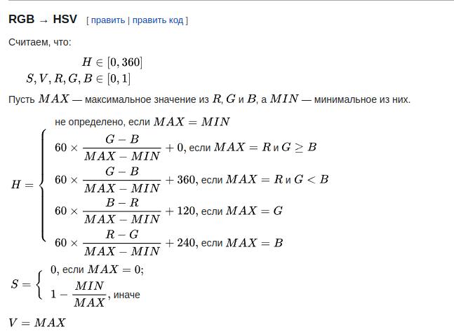
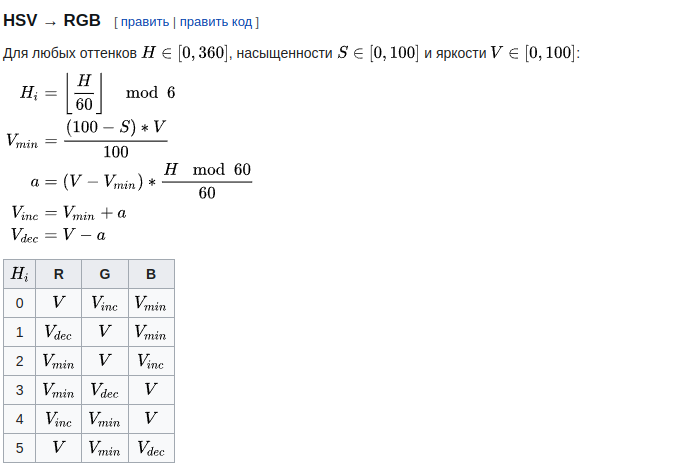
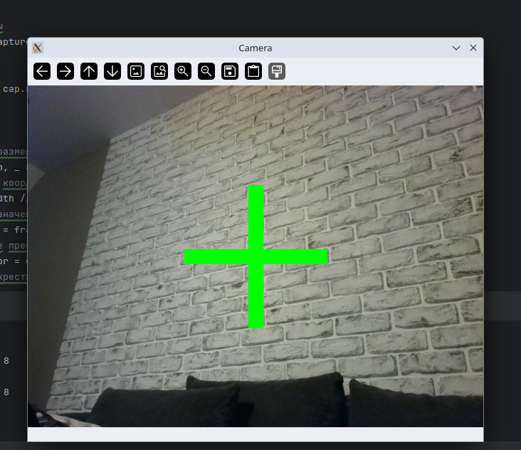

# Лабораторная работа №1 


1. Настроен проект, установлен opencv.


2. Выполнено задание 2, протестированы:
   - 3 расширения, 
   - 3 флага окна, 
   - 3 флага чтения изображения


imread - Для чтения изображений с различными флагами
namedWindow - Для настройки способа отображения
imshow - Для непосредственного отображения изображения в окне

```python
    image = cv2.imread("some_path", flags=some_flag)
    cv2.namedWindow("some_key", some_flag)
    cv2.imshow("some_key", image)
```
Флаги отображения окна:
   - cv2.WINDOW_GUI_NORMAL - стандартный GUI
   - cv2.WINDOW_AUTOSIZE - автоматический выбор размерности
   - cv2.WINDOW_GUI_EXPANDED - расширенный gui окна

Флаги чтения изображения:
   - cv2.IMREAD_COLOR - отсекает альфа канал
   - cv2.IMREAD_GRAYSCALE - читает в черно-белом формате
   - cv2.IMREAD_REDUCED_COLOR_8 - сжатие в 8 раз


3. Выполнено задание 3
   - отображено видео в окне
   - испробованы различные цветовые гаммы и размеры

   
VideoCapture - класс для чтения видеопотока
  
Источники:

  • Веб-камера (например, cv2.VideoCapture(0) для первой камеры)

   • Видео файлы (например, cv2.VideoCapture('video.mp4'))

   • RTSP или другие сетевые потоки.


```python
cap = cv2.VideoCapture('files/3.mp4')

# Проверяем, удалось ли открыть видео
if not cap.isOpened():
    print("Не удалось открыть видео")
    exit()

# Отображаем видео
while True:
    # Считываем кадр
    ret, frame = cap.read()
    
    # Обработка, вывод
    
    cv2.imshow('Video', frame)
    
    if cv2.waitKey(1) & 0xFF == 27:
        break
```


4. Выполнено задание 4
   - Записано видео из одного файла в другой файл

VideoWriter - класс записи видеопотока

Методы:
   - write для вывода фрейма

VideoWriter_fourcc - класс кодировки, используемой для определения формата видеопотока

```python

cap = cv2.VideoCapture(input_file)

Методы:
    - read - чтение следующего фрейма

# Получаем параметры входного видео
fps = cap.get(cv2.CAP_PROP_FPS)
width = int(cap.get(cv2.CAP_PROP_FRAME_WIDTH))
height = int(cap.get(cv2.CAP_PROP_FRAME_HEIGHT))

# Создаем выходной видеофайл
fourcc = cv2.VideoWriter_fourcc(*'mp4v')
out = cv2.VideoWriter(output_file, fourcc, fps, (width, height))

# Читаем и записываем кадры
while True:
    ret, frame = cap.read()
    if not ret:
        break
    out.write(frame)
```

5. Выполнено задание 5
   - Изображение сконвертировано в формат HSV


cvtColor - функция конверсии цвета изображения

COLOR_BGR2HSV - флаг из RGB в HSV

формулы:

Для HSV в RGB:


Для RGB в HSV:



```python
cv2.cvtColor(image, cv2.COLOR_BGR2HSV)
```


6. Выполнено задание 6
   - Прочитано изображение с камеры. 
   - Выведено в центре на экране Красный крест в формате, как на изображении. 
   - Указаны команды, которые позволяют это сделать:
     - cv2.rectangle
     - cv2.stackBlur

Получение ширины и высоты кадра:
```python

def get_frame_dimensions(cap):
    frame_width = int(cap.get(cv2.CAP_PROP_FRAME_WIDTH))
    frame_height = int(cap.get(cv2.CAP_PROP_FRAME_HEIGHT))
    return frame_width, frame_height

```

Рисование прямоугольников на кадре

используется метод rectangle

```python
        cv2.rectangle(frame, (x1 + offset_x, y1 + offset_y), (x2 + offset_x, y2 + offset_y), (0, 0, 255), 2)
```

Применение размытия в области прямоугольника
```python
def apply_blur(frame, rectangles, offset_x, offset_y, frame_height, frame_width):
    x1, y1 = rectangles[0][0]
    x2, y2 = rectangles[0][1]
    mask = np.zeros((frame_height, frame_width, 3), dtype=np.uint8)
    mask = cv2.rectangle(mask, (x1 + offset_x, y1 + offset_y), (x2 + offset_x, y2 + offset_y), (255, 255, 255), -1)
    blurred_frame = cv2.stackBlur(frame, (63, 63))  # Размытие
    frame[mask == 255] = blurred_frame[mask == 255]
```


7. Выполнено задание 7
   - Отображена информация с вебкамеры,
   - видео с вебкамеры записано в файл

Чтение потока с видеокамеры:
```python
 cap = cv2.VideoCapture(0)
```

8. Выполнено задание 8
   - Отображаем крест
   - Вычислен доминантный цвет в центральном пикселе креста
   - Заливаем крест вычесленным доминантным цветом


Извлекаем доминантный цвет
```python

def get_dominant_color(pixel):
    """Определяет преобладающий цвет по значению пикселя."""
    b, g, r = pixel
    if r > g and r > b:
        return (0, 0, 255)  # Красный
    elif g > r and g > b:
        return (0, 255, 0)  # Зеленый
    else:
        return (255, 0, 0)  # Синий

```



9. Выполнено задание 9
   - Настроен процесс подключения и стриминга с камеры устройства

Используется приложение ip webcam для стриминга видео с вебкамеры устройства

подключение идёт поверх протокола http

```python
# ip телефона
ip = str(input("Enter IP address: "))

# URL-адрес камеры телефона
url = f'http://{ip}:8080/video'
```
