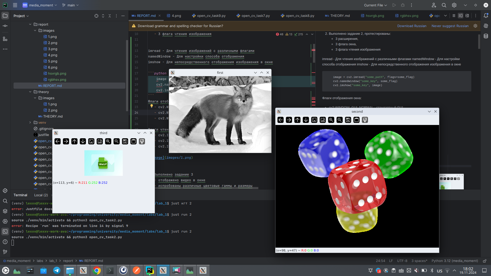
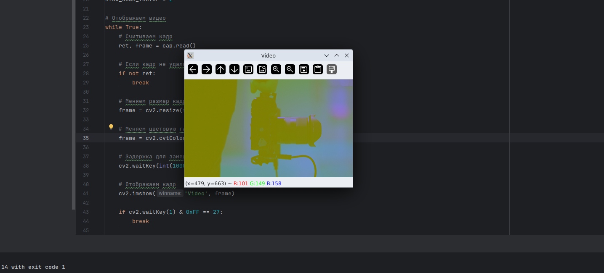
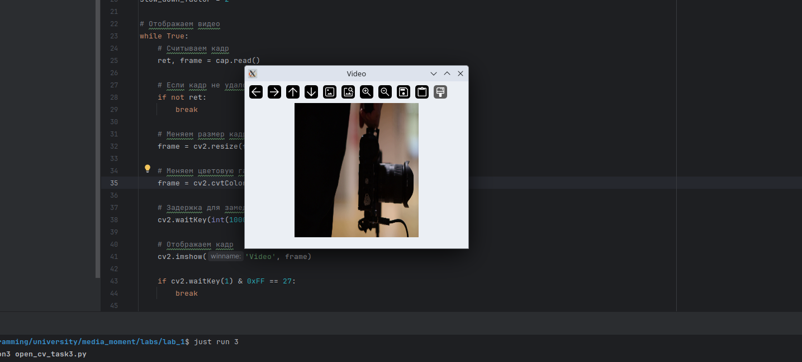
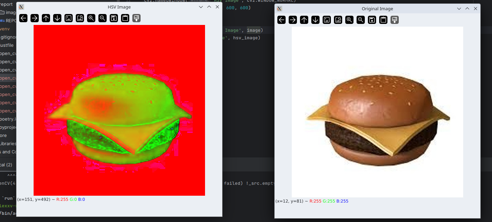
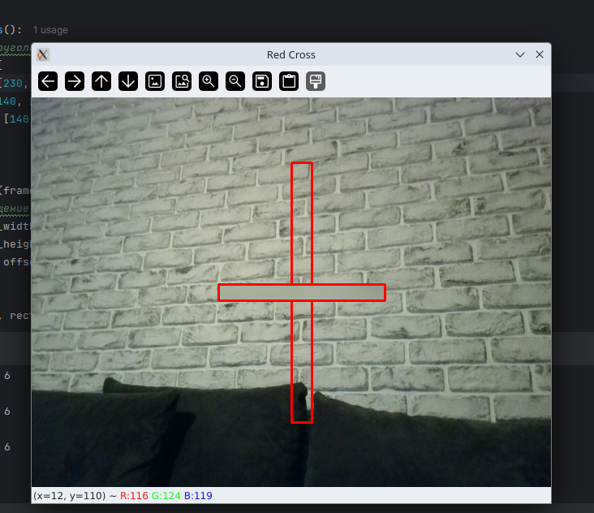

# Лабораторная работа №1 

1. Настроен проект, установлен opencv.

2. Выполнено задание 2, протестированы:
   - 3 расширения, 
   - 3 флага окна, 
   - 3 флага чтения изображения

3. Выполнено задание 3
   - отображено видео в окне
   - испробованы различные цветовые гаммы и размеры

4. Выполнено задание 4
   - Записано видео из одного файла в другой файл

5. Выполнено задание 5
   - Изображение сконвертировано в формат HSV

6. Выполнено задание 6
   - Прочитано изображение с камеры. 
   - Выведено в центре на экране Красный крест в формате, как на изображении. 
   - Указаны команды, которые позволяют это сделать:
     - cv2.rectangle
     - cv2.stackBlur

7. Выполнено задание 7
   - Отображена информация с вебкамеры,
   - видео с вебкамеры записано в файл

