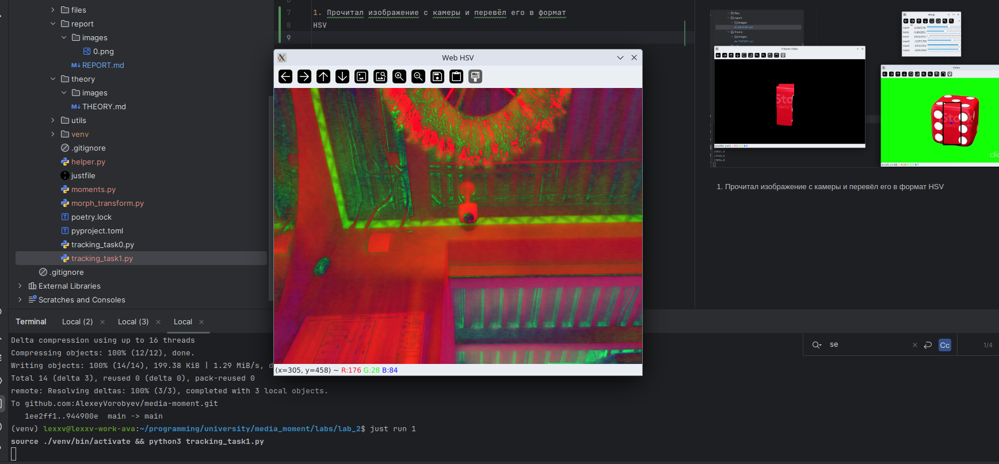
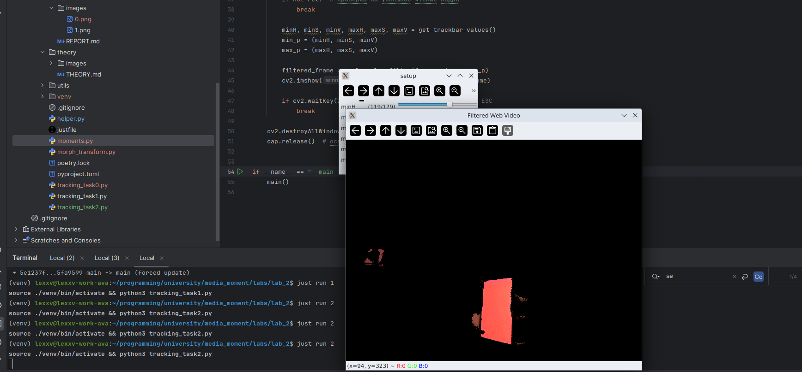

# Лабораторная работа №2

1. Прочитал изображение с камеры и перевёл его в формат
HSV

2. Применил фильтрацию изображения с помощью команды
inRange и оставил только красную часть, вывел получившееся изображение
на экран(treshold), выбрал красный объект и потестировал параметры
фильтрации, подобрав их нужного уровня

