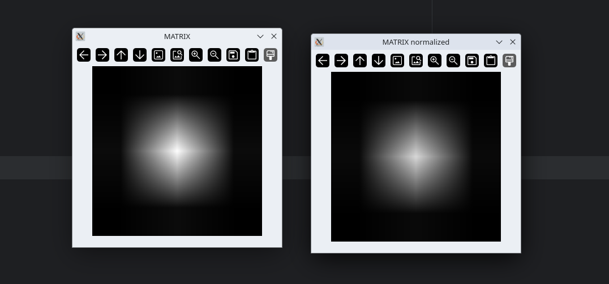
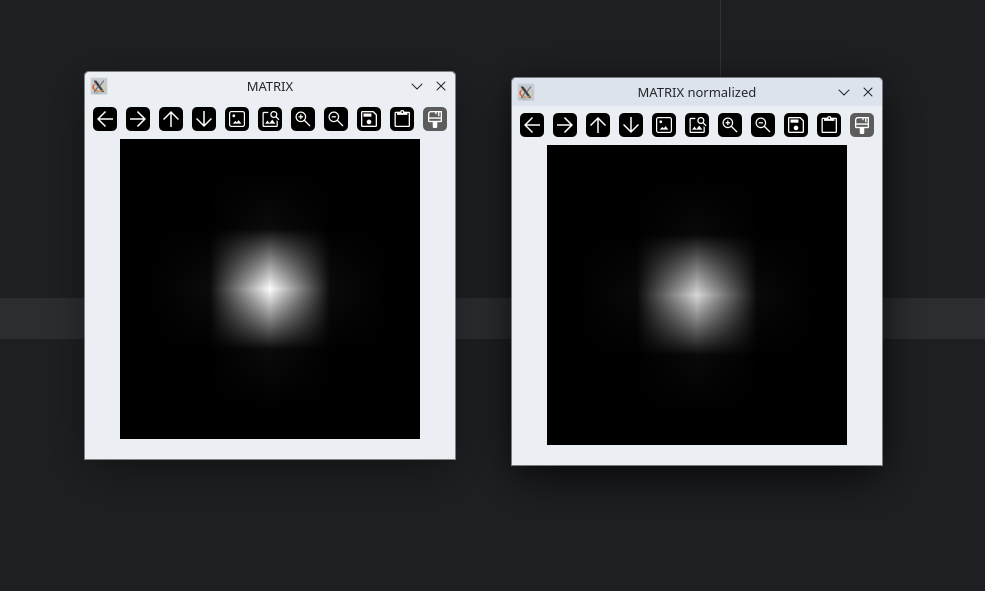
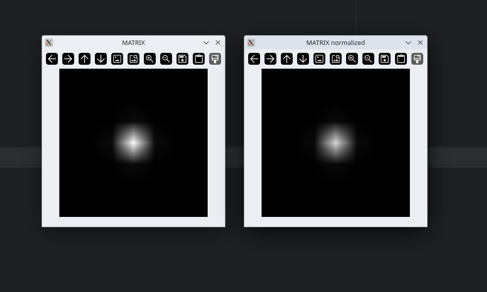
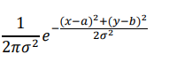

# Лабораторная работа № 3

1. Выполнил первые этапы алгоритма
    - установить размер матрицы свертки и среднее квадратичное
отклонение;
    - заполнить матрицу свертки значениями функции Гаусса с мат.
ожиданием, равным координатам центра матрицы;





Основная идея свёртки:
Ядро (обычно небольшого размера 3-7 пикселей) скользит по изображению.
На каждой позиции значения пикселей изображения умножаются на соответствующие значения ядра.
Результаты суммируются, и итоговая сумма записывается в соответствующую позицию выходного изображения.

Применение в обработке изображений:
   Размытие и подавление шума: для улучшения качества изображения.
   Обнаружение краёв: для выделения контуров объектов.
   Усиление контрастности и резкости.
   Обнаружение текстур: для анализа структуры изображения.
   Функции свёрточных нейронных сетей (CNN): используются для извлечения признаков на различных уровнях глубины.

Создание и заполнение матрицы свёртки:

```python
def conv_matrix(matrix_size: int, ms_deviation: float | int) -> np.ndarray:
    """
    Создание и заполнение матрицы свёртки
    :param matrix_size: Размер матрицы
    :param ms_deviation: Среднеквадратичное отклонение
    :return: Матрица numpy
    """
    matrix = np.zeros((matrix_size, matrix_size))  # Инициализируем матрицу нулями
    a = b = matrix_size // 2  # Считаем математическое ожидание двумерной случайной величины

    # Заполяем матрицу свёртки
    for y in range(matrix_size):
        for x in range(matrix_size):
            print(y, x)
            matrix[y, x] = gauss.gauss(x, y, ms_deviation, a, b)

    return matrix
```

Функция гаусса:



```python
def gauss(x: int, y: int, sigma: float | int, a: float | int, b: float | int) -> float:
    """
    Функция Гаусса
    :param x: Первый индекс матрицы
    :param y: Второй индекс матрицы
    :param sigma: Среднеквадратичное отклонение
    :param a: Мат. ожидание двумерной случайной величины
    :param b: Мат. ожидание двумерной случайной величины
    :return: Значение гауссовой функции
    """
    double_sigma_squared = 2 * sigma * sigma
    return np.exp(-((x - a) ** 2 + (y - b) ** 2) / double_sigma_squared) / (np.pi * double_sigma_squared)
```

2. Нормализовал матрицу

```python
def normalize_matrix(matrix: np.ndarray) -> np.ndarray:
    """
    Нормируем матрицу, чтобы сумма элементов была равна 1
    :param matrix: Исходная матрица
    :return: Нормализованная матрица
    """
    return matrix / np.sum(matrix)
```

3. Имплементировал алгоритм блюра гаусса на python

Операция свертки заключается в преобразовании исходной
матрицы B размерности 𝑛 × 𝑛 в числовое значение с помощью специальной
матрицы ker размерности 𝑛 × 𝑛, называемой ядром свертки

```python
def conv_operation(
        item_x: int,
        item_y: int,
        image: np.ndarray,
        kernel: np.ndarray,
        kernel_size: int
) -> float:
    """
    Проводит операцию свёртки

    :param item_x: Индекс элемента исходной матрицы по горизонтали
    :param item_y: Индекс элемента исходной матрицы по вертикали
    :param image: Изображение
    :param kernel: Ядро свёртки
    :param kernel_size: Размер ядра свёртки
    :return:
    """
    value = 0
    half_size = int(kernel_size // 2)
    for k in range(-half_size, half_size + 1):
        for l in range(-half_size, half_size + 1):
            value += image[item_y + k, item_x + l] + kernel[k + half_size, l + half_size]

    return value
```

Непосредственно функция:

```python
def gauss_blur(
        image: np.ndarray,
        kernel_size: int,
        deviation: float
) -> np.ndarray:
    """
        Осуществляет блюр изображения с помощью матрицы свёртки и распределения по гауссу.

        :param: image: Изображение
        :param: kernel_size: Размерность ядра, должно быть нечётным
        :param: deviation: Стандартное отклонение для гаусса

        :return: Обработанное изображение
        """

    if kernel_size % 2 == 1:
        raise Exception('Kernel size must be odd.')

    kernel = nm.normalize_matrix(
        convm.conv_matrix(kernel_size, deviation)
    )

    blurred_image = image.copy()
    h, w = image.shape[:2]
    half_kernel_size = int(kernel_size // 2)

    for y in range(half_kernel_size, h - half_kernel_size):  # Проход по матрице вертикально
        for x in range(half_kernel_size, w - half_kernel_size):  # Проход по матрице горизонтально
            # Операция свёртки
            blurred_val = conv_operation(x,y,blurred_image, kernel, kernel_size)

            blurred_image[y, x] = blurred_val

    return image
```