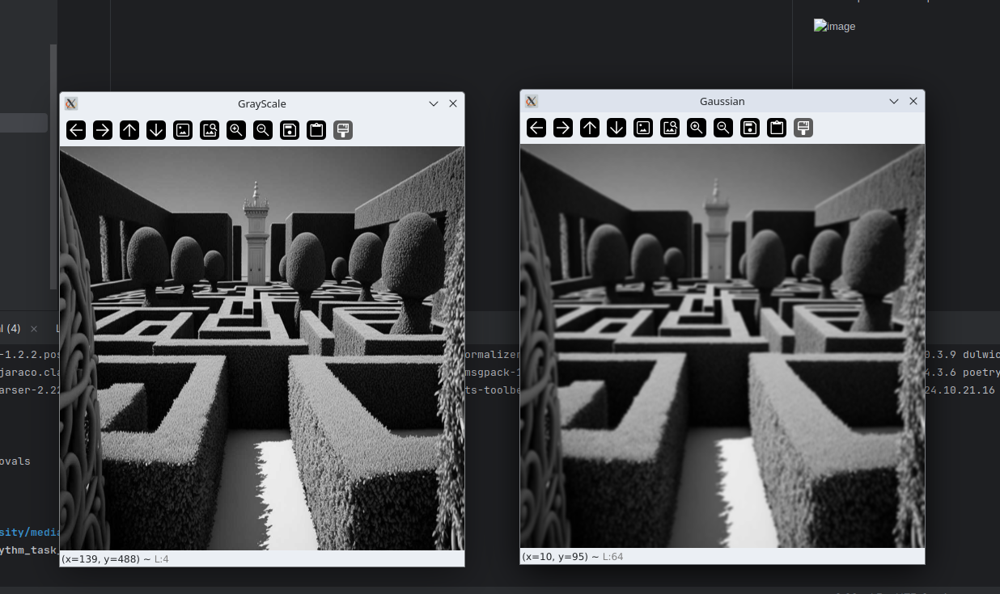
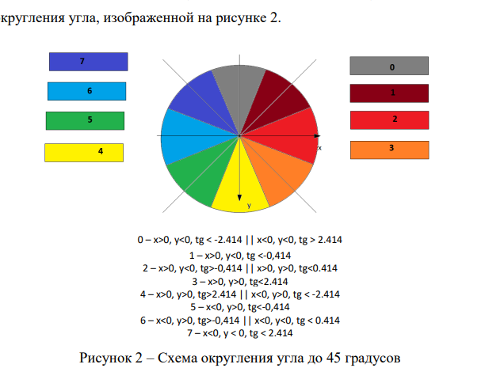
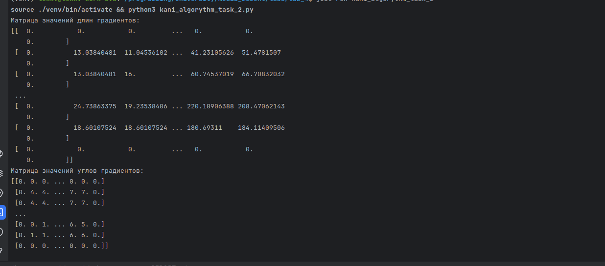
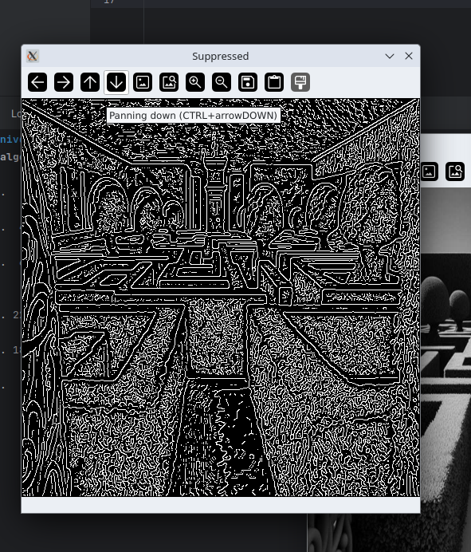
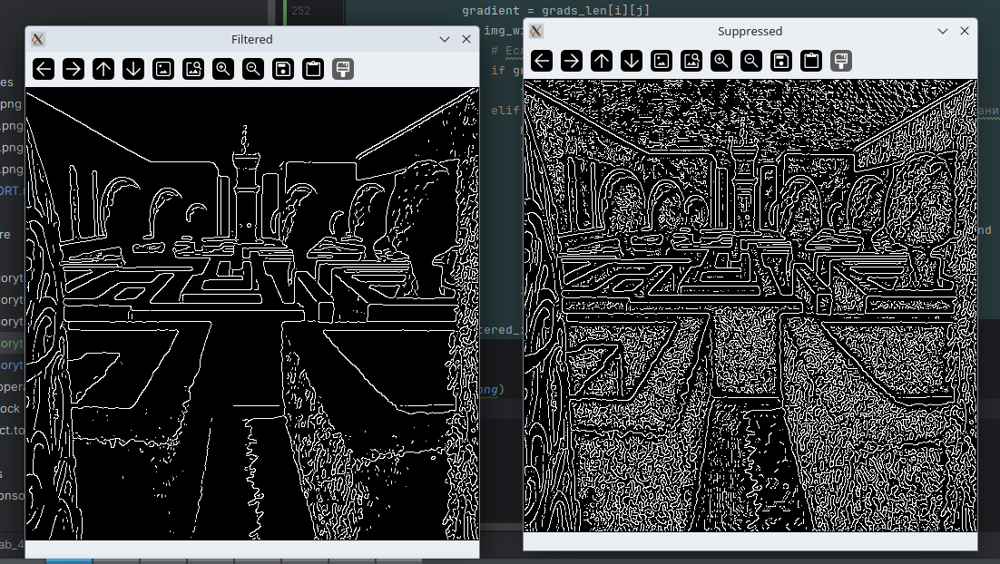
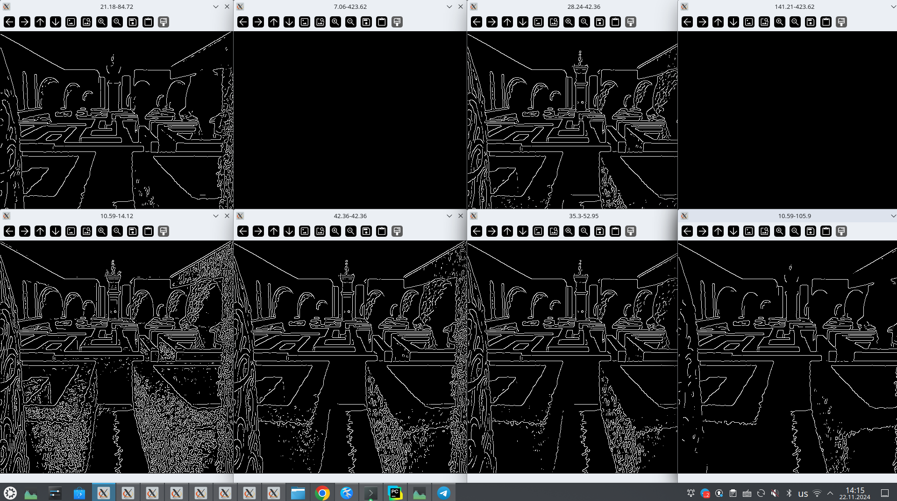
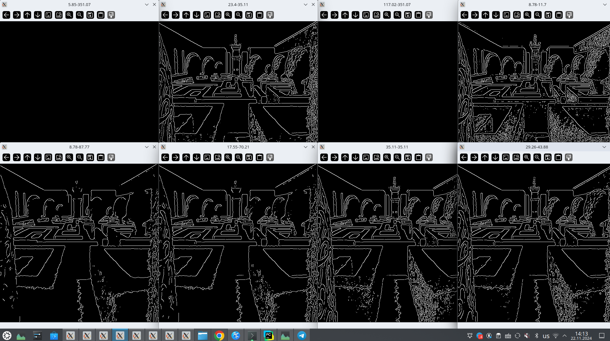
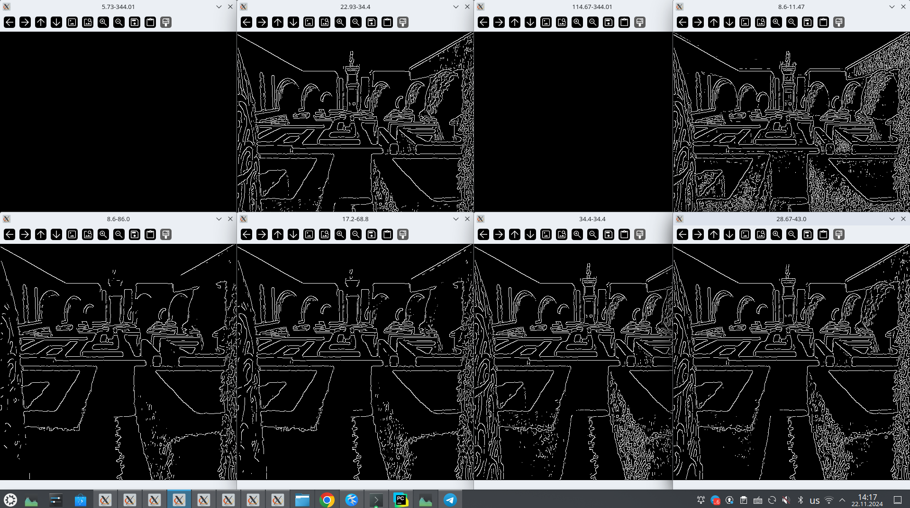
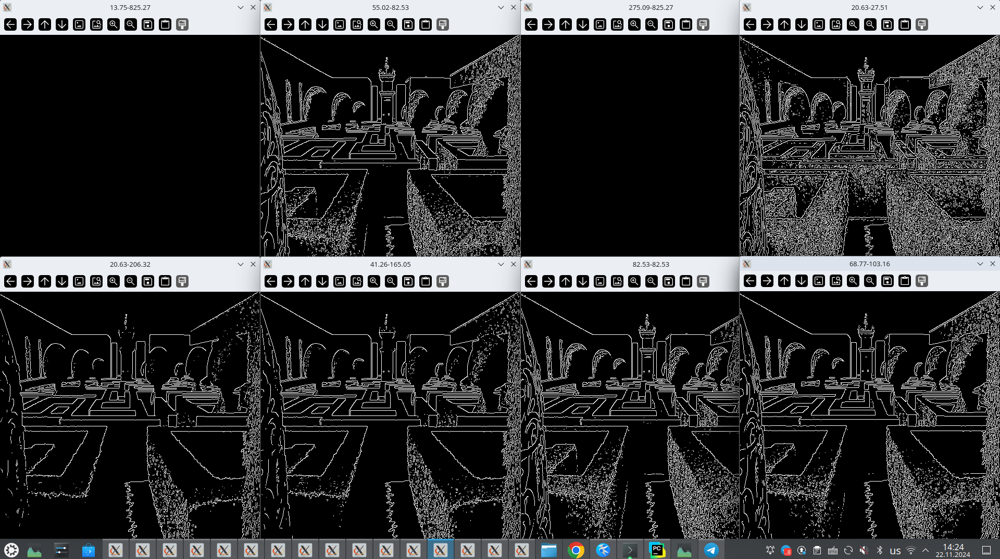

# Лабораторная работа № 4

1.  Реализован метод, который:
    - принимает в качестве строки
    - полный адрес файла изображения
    - читает изображение,
    - переводит его в черно белый цвет и выводит его на экран 
    - применяет размытие по Гауссу и выводит полученное изображение на экран

```python
# Инициализируем класс
kaniAlgo = KaniAlgorythm(
    image_size=(500,500),
    image_show_list=[
        ImageShowKaniAlgorythmEnum.GRAYSCALE,
        ImageShowKaniAlgorythmEnum.GRAYSCALE,
    ],
    kernel_size=5,
    deviation=1.5
)

# Обрабатываем изображение
kaniAlgo.process_image('files/1.jpg')
```

Демонстрация:



2. Модифицировать построенный метод:
    - Вычисляляю и вывожу на экран две матрицы – матрица значений длин и матрица значений углов градиентов всех пикселей изображения.

Для нахождения градиента изображения используется оператор собеля
```python
class SobelOperator(MatrixOperator):

    def x_matrix(self, img, x, y):
        """
        Применение оператора Собеля для нахождения Gx
        Матрица выглядит следующим образом:
        -1 0 1
        -2 0 2
        -1 0 1
        :param img: Исходное изображение
        :param x: Координата пикселя по X
        :param y: Координата пикселя по Y
        :return:
        """
        return -int(img[x - 1][y - 1]) - 2 * int(img[x][y - 1]) - int(img[x + 1][y - 1]) + \
            int(img[x - 1][y + 1]) + 2 * int(img[x][y + 1]) + int(img[x + 1][y + 1])

    def y_matrix(self, img, x, y):
        """
        Применение оператора Собеля для нахождения Gy
        Матрица выглядит следующим образом:
        -1 -2 -1
        0 0 0
        1 2 1
        :param img: Исходное изображение
        :param x: Координата пикселя по X
        :param y: Координата пикселя по Y
        :return:
        """
        return -int(img[x - 1][y - 1]) - 2 * int(img[x - 1][y]) - int(img[x - 1][y + 1]) + \
            int(img[x + 1][y - 1]) + 2 * int(img[x + 1][y]) + int(img[x + 1][y + 1])
```

Затем получаем матрицу длин градиентов:
```python
    def __get_grad_length(self, img: np.ndarray, grads: list[list[tuple]]) -> np.ndarray:
        """
        Получить матрицу длин градиентов
        :param img:
        :param grads:
        :return:
        """
        grads_length = np.zeros((img.shape[0], img.shape[1]))
        grad_x_coord = 0
        for x in range(1, img.shape[0] - 1):
            grad_y_coord = 0
            for y in range(1, img.shape[1] - 1):
                Gx, Gy = grads[grad_x_coord][grad_y_coord]
                grads_length[x, y] = math.sqrt(Gx ** 2 + Gy ** 2)
                grad_y_coord = grad_y_coord + 1
            grad_x_coord = grad_x_coord + 1
        return grads_length
```

Затем получаем матрицу углов градиентов:
```python
    def __get_corners(self, img: np.ndarray, grads: list[list[tuple]]) -> np.ndarray:
        """
        Получить матрицу углов градиентов
        :param img:
        :param grads:
        :return:
        """
        corners = np.zeros((img.shape[0], img.shape[1]))
        grads_len = len(grads[0])
        corner_x = 1
        for i in range(len(grads)):
            corner_y = 1
            for j in range(grads_len):
                corners[corner_x, corner_y] = self.__get_corner_by_grad(grads[i][j])
                corner_y += 1
            corner_x += 1
        return corners
```



Вычисляем угол на основе градиента:
```python
    def __get_corner_by_grad(self, grad: tuple) -> int:
        """
        Получить округлённое значение угла по его градиенту
        :param grad:
        :return:
        """
        Gx, Gy = grad
        tang = Gy / Gx if Gx != 0 else 999
        if Gx > 0 > Gy and tang < -2.414 or Gx < 0 and Gy < 0 and tang > 2.414:
            return 0
        elif Gx > 0 > Gy and tang < -0.414:
            return 1
        elif Gx > 0 > Gy and tang > -0.414 or Gx > 0 and Gy > 0 and tang < 0.414:
            return 2
        elif Gx > 0 and Gy > 0 and tang < 2.414:
            return 3
        elif Gx > 0 and Gy > 0 and tang > 2.414 or Gx < 0 < Gy and tang < -2.414:
            return 4
        elif Gx < 0 < Gy and tang < -0.414:
            return 5
        elif Gx < 0 < Gy and tang > -0.414 or Gx < 0 and Gy < 0 and tang < 0.414:
            return 6
        elif Gx < 0 and Gy < 0 and tang < 2.414:
            return 7
        if Gx == 0:
            if Gy > 0:
                return 4
            elif Gy <= 0:
                return 0
        else:
            if Gy > 0:
                return 2
            elif Gy <= 0:
                return 6
```



3. Модифицировал метод так, чтобы он выполнял подавление
немаксимумов и выводил полученное изображение на экран.

Подавляем немаксимумы

```python
    def __not_max_suppress(self, grads_len: np.ndarray, corners: np.ndarray) -> np.ndarray:
        """
        Подавление немаксимумов
        :param grads_len: Матрица длин градиентов
        :param corners: Матрица углов градиентов
        :return:
        """
        height, width = grads_len.shape
        bordered_image = np.zeros_like(grads_len)

        for y in range(1, height - 1):
            for x in range(1, width - 1):
                angle = int(corners[x][y])
                first_neigh, second_neigh = self.__get_grad_neighbors_by_angle(grads_len, x, y, angle)

                if grads_len[x][y] > first_neigh and grads_len[x][y] > second_neigh:
                    bordered_image[x][y] = 255
                else:
                    bordered_image[x][y] = 0

        return bordered_image
```

Получаем длину градиентов двух соседних пикселей

```python
    def __get_grad_neighbors_by_angle(self, grads_len: np.ndarray, x: int, y: int, angle: int) -> tuple:
        """
        Получить длины градиентов двух соседних пикселей
        :param grads_len:
        :param x:
        :param y:
        :param angle:
        :return:
        """
        if angle == 0 or angle == 4:
            return grads_len[x + 1][y], grads_len[x - 1][y]
        elif angle == 1 or angle == 5:
            return grads_len[x - 1][y + 1], grads_len[x + 1][y - 1]
        elif angle == 2 or angle == 6:
            return grads_len[x][y + 1], grads_len[x][y - 1]
        elif angle == 3 or angle == 7:
            return grads_len[x + 1][y + 1], grads_len[x - 1][y - 1]
        else:
            return -9999999, -9999999
```

На изображении были подавлены пиксели, которые не являются локальными максимуми, инымми словами были выделены граница объектов 

ГРАНИЦЕЙ БУДЕТ СЧИТАТЬСЯ ПИКСЕЛЬ, ГРАДИЕНТ КОТОРОГО
МАКСИМАЛЕН В СРАВНЕНИИ С ПИКСЕЛЯМИ ПО НАПРАВЛЕНИЮ
НАИБОЛЬШЕГО РОСТА ФУНКЦИИ



4. Проведу двойную пороговую фильтрацию

Суть метода:

```python
max_gradient = np.max(grads_len)
print(max_gradient)
lower_bound = max_gradient / self._threshold_dividers[0]
upper_bound = max_gradient / self._threshold_dividers[1]
```

- Ставим MAX и MIN границы значенния градиента
- Фильтруем границы. Если > MAX, то точно граница Если < MIN то точно не граница, дале рассматриваем < MAX и > MIN

Те значения что внутри диапазона мы проверяем пограничные пиксели, если хотя бы 1 - граница то и этот граница.

```python
    def __double_threshold_filter(
            self,
            img: np.ndarray,
            img_with_borders: np.ndarray,
            grads_len: np.ndarray,
    ):
        """
        Выполнить двойную пороговую фильтрацию
        :param img: Изображение
        :param img_with_borders: Изображение с уже отмеченными границами
        :param grads_len: Матрица длин градиентов
        :return:
        """
        max_gradient = np.max(grads_len)
        print(max_gradient)
        lower_bound = max_gradient / self._threshold_dividers[0]
        upper_bound = max_gradient / self._threshold_dividers[1]
        print(f'Нижняя граница {lower_bound}, Верхняя: {upper_bound}')
        filtered_img = np.zeros(img.shape)

        for i in range(0, img.shape[0]):
            for j in range(0, img.shape[1]):
                gradient = grads_len[i][j]
                if img_with_borders[i][j] == 255:
                    # Если выше верхней границы, то точно входит
                    if gradient > upper_bound:
                        filtered_img[i][j] = 255
                    elif lower_bound <= gradient <= upper_bound:  # Если между двумя границами - нужно проверить соседей
                        has_neigh_border = False
                        for k in range(-1, 2):
                            for l in range(-1, 2):
                                if (
                                        img_with_borders[i + k][j + l] == 255
                                        and img_with_borders[i + k][j + l] >= upper_bound
                                ):
                                    has_neigh_border = True
                        if has_neigh_border:
                            img_with_borders[i][j] = 255
        return filtered_img
```

## Результаты:



### Провёл опыты для различных параметров размытия и пороговых значений

Размытие - 1.5



Размытие - 3



Размытие - 10



Размытие - 0.001


