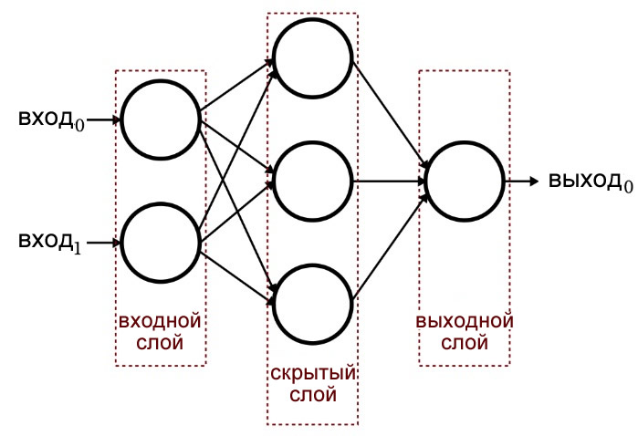
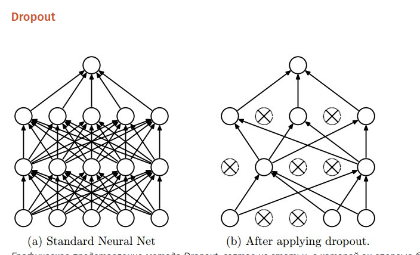
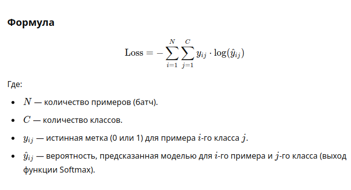

# Лабораторная работа № 6

### Распознавание цифр с применением MLP

Для выполнения 1-ого задания используется нейронная сеть **MLP**, которая обучается с использованием библиотеки keras

**MLP** - Mutilayer perceptron, или Многослойный перцептрон, это перцептрон, который включает в себя скрытые слои,
помимо входного и выходного

**Перцептрон** — это базовая модель искусственного нейрона, разработанная для выполнения задач классификации и
распознавания образов.
Он является одним из первых алгоритмов машинного обучения,
основанных на принципах работы человеческого мозга,
и был предложен Фрэнком Розенблаттом в 1958 году.

**Эпоха** в обучении нейронной сети — это один полный проход по всему обучающему набору данных. Во время эпохи модель
обрабатывает все доступные данные и обновляет свои параметры (веса и смещения) на основе вычисленной ошибки.

#### Как работает эпоха:

> **Разбиение данных на батчи**:
> Обычно данные делятся на небольшие части (батчи), так как обработать весь набор данных за один раз может быть слишком
> ресурсоемко.
> Размер батча определяется параметром batch_size.
>
> **Обработка каждого батча**:
> Для каждого батча модель делает предсказания, вычисляет функцию потерь и обновляет веса через алгоритм обратного
> распространения ошибки с использованием градиентного спуска.
>
> **Проход через весь набор данных**:
> После обработки всех батчей эпоха завершается.

Было выполнено построение модели **многослойного перцептрона** для обработки изображений цифр с **MNIST**

# Описание **архитектур** построенных моделей:

## Многослойный перцептрон:

### **1. Входной слой**

> Размер входа:
> 28 × 28 = 784 (размер одного изображения из MNIST после преобразования в одномерный массив).
>
> Входное изображение передается в виде одномерного массива длиной
> 784, где каждый элемент представляет собой нормализованное значение яркости пикселя
(диапазон от 0.0 до 1.0)

### **2. Первый полносвязный слой**

> Количество нейронов: 512.
>
> Функция активации: ReLU (Rectified Linear Unit).
> Преобразует взвешенную сумму входов по формуле:
> f(x)=max(0,x).
>
> Преимущество ReLU: предотвращает проблему исчезающего градиента и ускоряет обучение.
> Каждый из 512 нейронов подключён ко всем 784 входам.

_Статья хабр о проблеме исчезающего градиента_ - https://habr.com/ru/articles/462381/

### **3. Первый Dropout-слой**

> Вероятность отключения нейронов: 20% (0.2).
>
> На каждой итерации обучения случайно отключается 20% нейронов, чтобы предотвратить переобучение.

_Статья хабр о dropout_ - https://habr.com/ru/companies/wunderfund/articles/330814/

Сети для обучения получаются с помощью исключения из сети (dropping out) нейронов с вероятностью $p$, таким образом,
вероятность того, что нейрон останется в сети, составляет $q=1-p$. “Исключение” нейрона означает, что при любых входных
данных или параметрах он возвращает 0.

### **4. Второй полносвязный слой**

> Количество нейронов: 512.
>
> Функция активации: ReLU (Rectified Linear Unit).
> Преобразует взвешенную сумму входов по формуле:
> f(x)=max(0,x).

### **5. Второй Dropout-слой**

> Вероятность отключения нейронов: 20% (0.2).
>
> На каждой итерации обучения случайно отключается 20% нейронов, чтобы предотвратить переобучение.

### **6. Выходной слой**

> Количество нейронов: 10 (по числу классов цифр от 0 до 9).
> Роль: Предсказать вероятность принадлежности входного изображения к одному из 10 классов.

## Свёрточная нейронная сеть:

### **1. Входной слой**

> Форма входа: (width, height, depth).
>
> width и height: размеры изображения (например, 28x28 для MNIST).
>
> depth: количество каналов (например, 1 для черно-белых изображений или 3 для цветных RGB-изображений).

### **2. Первичный свёрточный слой**

> Проводи непосредственную свёртку изображения используя ядро (3x3) в нашем случае
> filters: int, the dimension of the output space (the number of filters in the convolution).
>
> Фильтр - это некоторое ядро свёртки, которое выявляет некоторый признак
>
> На выходе имеем карты признаков по каждому фильтру

### **3. Слой подвыборки (MaxPooling2D)**

> Размер окна: 2×2.
>
> Роль - Уменьшение пространственного размера карт признаков (в 2 раза по ширине и высоте).
>
> Результат - Каждая карта признаков становится вдвое меньше по размеру

### **4. Слой выравнивания (Flatten)**

> Преобразует двумерные карты признаков в одномерный вектор.
>
> Результат - Одномерный вектор, длина которого зависит от размера карт признаков после свертки и пуллинга.

### **5. Полносвязный слой**

> Количество нейронов: 512.
>
> Функция активации: ReLU (Rectified Linear Unit).
> Преобразует взвешенную сумму входов по формуле:
> f(x)=max(0,x).

### **6. Dropout-слой**

> Вероятность отключения нейронов: 20% (0.2).
>
> На каждой итерации обучения случайно отключается 20% нейронов, чтобы предотвратить переобучение.

### **7. Выходной слой**

> Количество нейронов: 10 (по числу классов цифр от 0 до 9).
> Роль: Предсказать вероятность принадлежности входного изображения к одному из 10 классов.

# Результаты классификации цифр на датасете MNIST

## Многослойный перцептрон

| Количество эпох | Точность | Потеря | Время обучения (сек) | Время проверки (сек) |
|-----------------|----------|--------|----------------------|----------------------| 
| 1               | 0.9585   | 0.1255 | 5.629220             | 1                    |
| 2               | 0.9684   | 0.1023 | 6.325084             | 1                    |
| 5               | 0.9707   | 0.0945 | 13.133765            | 1                    |
| 20              | 0.9801   | 0.0937 | 46.253127            | 1                    |
| 50              | 0.9835   | 0.1043 | 103.562231           | 1                    |
| 100             | 0.9832   | 0.1806 | 205.426771           | 1                    |
| 1000            | 0.9830   | 0.5230 | 1016.115069          | 1                    |

### Вывод:

Видим, что чрезмерное повышение количества эпох не приводит к существенному увеличению точности модели,
но повышает значение функции потери

**Функция потерь** - кросс-энтропия

Кросс-энтропия измеряет разницу между истинным распределением классов и распределением, предсказанным моделью. Основная
цель модели — минимизировать эту разницу.

Феномен того, что при такой же +- точности увеличивается значение функции потери объясняется тем,
что модель делает менее уверенные высказывания на корректных данных (в связи с переобучением)
и более уверенные на некорректных данных (вероятно к этому случаю это не относится)

## Свёрточная нейронная сеть

| Количество эпох | Точность | Потеря | Время обучения (сек) | Время проверки (сек) |
|-----------------|----------|--------|----------------------|----------------------| 
| 1               | 0.9736   | 0.0751 | 12.923501            | 1                    |
| 2               | 0.9792   | 0.0566 | 22.098835            | 1                    |
| 5               | 0.9815   | 0.0487 | 52.847397            | 1                    |
| 20              | 0.9849   | 0.0685 | 192.872451           | 1                    |
| 50              | 0.9848   | 0.1312 | 485.929832           | 1                    |
| 100             | 0.9875   | 0.1414 | 952.781081           | 1                    |

### Вывод:

Видим, что чрезмерное повышение количества эпох не приводит к существенному увеличению точности модели,
но повышает значение функции потери

## Общий вывод:

Исходя из результата обучения и проверки двух моделей сделаем выводы:

1. CNN справляется с распознаванием лучше, чем традиционный MLP
2. CNN обучать дольше, чем традиционный MLP
3. Мера потери значительно ниже у CNN
4. Скорость работы не отличается

# ТЕОРИЯ:

### 1. Принцип обучения нейронной сети с учителем

Обучение с учителем (supervised learning) предполагает использование размеченного набора данных, где каждому входу соответствует правильный выход (метка). Процесс состоит из следующих шагов:

1. **Инициализация весов**: Начальные веса нейронов устанавливаются случайно или с помощью специальных методов.
2. **Прямой проход (Forward Propagation)**:
   - Входные данные проходят через сеть, и на выходе генерируется предсказание.
3. **Вычисление ошибки**:
   - Разница между предсказанием сети и истинным значением оценивается с помощью функции потерь (например, MSE, Cross-Entropy).
4. **Обратное распространение ошибки (Backpropagation)**:
   - Вычисляются градиенты функции потерь по весам сети, чтобы понять, как каждый параметр влияет на ошибку.
5. **Обновление весов**:
   - Веса корректируются с использованием оптимизационных алгоритмов (например, SGD, Adam), чтобы уменьшить ошибку.
6. **Повторение**:
   - Процесс повторяется для всех данных до достижения минимальной ошибки или установленного количества эпох.

---

### 2. Структура нейрона

Нейрон — базовый строительный блок нейронной сети, который моделирует работу биологического нейрона. Его структура:
- **Входы (\(x_1, x_2, \ldots, x_n\))**: Принимают значения из предыдущего слоя или данных.
- **Веса (\(w_1, w_2, \ldots, w_n\))**: Определяют значимость каждого входа.
- **Сумматор**: Вычисляет взвешенную сумму входов:
  \[
  z = \sum_{i=1}^{n} w_i x_i + b
  \]
  где \(b\) — смещение (bias).
- **Функция активации**: Преобразует взвешенную сумму в выходное значение, добавляя нелинейность. Примеры функций активации: ReLU, Sigmoid, Tanh.
- **Выход (\(y\))**: Передается в следующий слой.

---

### 3. Структура перцептрона

Перцептрон — это простейшая нейронная сеть. Его структура:
1. **Входной слой**:
   - Принимает данные. Каждый вход умножается на соответствующий вес.
2. **Сумматор**:
   - Вычисляет взвешенную сумму входов.
3. **Функция активации (пороговая)**:
   - Если сумма превышает заданный порог, выход равен 1, иначе 0.
4. **Выход**:
   - Результат классификации (например, принадлежность к одному из двух классов).

**Ограничение**: перцептрон может работать только с линейно разделимыми данными.

---

### 4. Смысл применения оптимизационных методов

Оптимизационные методы используются для минимизации функции потерь, что позволяет нейронной сети находить оптимальные веса. Без оптимизации сеть не может обучаться. 

#### Основные задачи оптимизации:
- Ускорение обучения.
- Преодоление локальных минимумов функции потерь.
- Баланс между скоростью обучения и качеством результата.

#### Примеры методов:
- **SGD (Stochastic Gradient Descent)**: Простое обновление весов по направлению антиградиента.
- **Adam**: Совмещает адаптивный шаг обучения и моменты градиента.
- **RMSprop**: Использует скользящее среднее квадрата градиента для корректировки шага обучения.

---

### 5. Что такое аугментация?

Аугментация — это метод увеличения обучающего набора данных путем искусственного создания новых данных из существующих. Используется для уменьшения переобучения и улучшения обобщающей способности модели.

#### Примеры аугментации изображений:
- Повороты, отражения, сдвиги.
- Изменение яркости, контрастности.
- Шум, размытие.

#### Примеры аугментации текста:
- Синонимизация.
- Перестановка слов.
- Удаление слов.

#### Примеры аугментации данных временных рядов:
- Добавление шума.
- Ускорение/замедление времени.

---

### 6. Принцип пакетного и последовательного обучения. Что такое batch_size?

#### **Пакетное обучение (Batch Training)**:
- Данные делятся на небольшие пакеты (батчи).
- Веса обновляются после обработки каждого батча.
- Параметр `batch_size` определяет количество примеров в одном батче.

#### Преимущества:
- Эффективное использование памяти.
- Гладкие обновления весов.

#### **Последовательное обучение (Online Training)**:
- Веса обновляются после обработки каждого примера.
- Менее стабильно, но может быть полезно для потоковых данных.

#### Параметр **batch_size**:
- Это размер подмножества данных, обрабатываемого на одной итерации.
- Например:
  - Если `batch_size=32`, на одной итерации обрабатывается 32 примера.
  - Для датасета с 320 примерами потребуется 10 итераций на одну эпоху.

### 7. Примеры функций активации

### Функции активации

#### **1. ReLU (Rectified Linear Unit)**
\[
f(x) = \max(0, x)
\]
- **Описание**: Возвращает \(x\), если \(x > 0\), иначе \(0\).
- **Применение**: 
  - Используется в скрытых слоях.
  - Подходит для большинства современных нейронных сетей.
- **Плюсы**:
  - Простая и эффективная.
  - Устраняет проблему исчезающего градиента.
- **Минусы**:
  - Проблема "мёртвых нейронов" (если веса обновляются так, что \(x \leq 0\)).

---

#### **2. Linear (линейная)**
\[
f(x) = x
\]
- **Описание**: Простая линейная передача входного значения без изменений.
- **Применение**:
  - Редко используется в скрытых слоях.
  - Часто применяется в выходных слоях для регрессии.
- **Плюсы**:
  - Легкость вычисления.
- **Минусы**:
  - Не добавляет нелинейности, что ограничивает возможности модели.

---

#### **3. Softmax**
\[
f_i(x) = \frac{e^{x_i}}{\sum_{j=1}^C e^{x_j}}
\]
- **Описание**: Преобразует набор значений в вероятности, где сумма всех значений равна 1.
- **Применение**:
  - Выходной слой для задач многоклассовой классификации.
- **Плюсы**:
  - Удобна для интерпретации как вероятность.
- **Минусы**:
  - Чувствительна к большим значениям, что может вызывать числовую нестабильность.

---

#### **4. Sigmoid**
\[
f(x) = \frac{1}{1 + e^{-x}}
\]
- **Описание**: Ограничивает выходные значения в диапазоне \( (0, 1) \).
- **Применение**:
  - Выходные слои для задач бинарной классификации.
- **Плюсы**:
  - Гладкая и монотонная функция.
- **Минусы**:
  - Проблема исчезающего градиента.
  - Низкая производительность для больших \(x\) (выходы становятся слишком малы).

---
